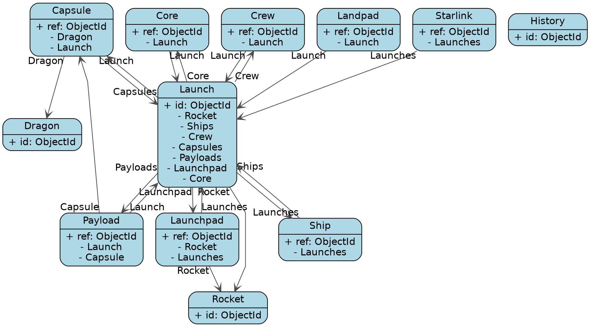

# SpaceX-API notes

Source:
`https://github.com/r-spacex/SpaceX-API/tree/master`

## Schema

* Capsule ref: Dragon, Launch
* Core ref: Launch
* Crew ref: Launch
* Dragon 
* History 
* Landpad ref: Launch
* Launch ref: Rocket(has-one), Ships(has-many), Crew(has-many), Capsules(has-many), Payloads(has-many), Launchpad(has-one), Core(has-many)
* Launchpad ref: Rocket(has-many), Launches(has-many)
* Payload ref: Launch(has-one), Capsule(has-one) 
* Rocket 
* Ship ref: Launches(has-many)
* Starlink ref: Launches(has-one)

## Schema Visualization
Used [ChatGPT3.5](https://chat.openai.com/) to create a `.dotfile`, and [GraphvizOnline](https://dreampuf.github.io/GraphvizOnline) to visualize the MongoDB schema by the API.
 
[Visualization via GraphViz](https://dreampuf.github.io/GraphvizOnline/#digraph%20mongodb%20%7B%0A%20%20%20%20rankdir%3DTB%3B%0A%20%20%20%20fontname%3D%22Helvetica%22%3B%0A%20%20%20%20newrank%3Dtrue%3B%20%20%2F%2F%20Enables%20new%20ranking%20engine%0A%20%20%20%20splines%3Dpolyline%3B%20%20%2F%2F%20Straightens%20lines%0A%20%20%20%20%0A%20%20%20%20node%20%5Bshape%3Drecord%2C%20style%3D%22rounded%2Cfilled%22%2C%20fillcolor%3Dlightblue%2C%20fontname%3D%22Helvetica%22%2C%20labelloc%3Dl%5D%3B%0A%0A%20%20%20%20Capsule%20%5Blabel%3D%22%7BCapsule%7C%2B%20ref%3A%20ObjectId%5Cn-%20Dragon%5Cn-%20Launch%7D%22%5D%3B%0A%20%20%20%20Core%20%5Blabel%3D%22%7BCore%7C%2B%20ref%3A%20ObjectId%5Cn-%20Launch%7D%22%5D%3B%0A%20%20%20%20Crew%20%5Blabel%3D%22%7BCrew%7C%2B%20ref%3A%20ObjectId%5Cn-%20Launch%7D%22%5D%3B%0A%20%20%20%20Dragon%20%5Blabel%3D%22%7BDragon%7C%2B%20id%3A%20ObjectId%7D%22%5D%3B%0A%20%20%20%20History%20%5Blabel%3D%22%7BHistory%7C%2B%20id%3A%20ObjectId%7D%22%5D%3B%0A%20%20%20%20Landpad%20%5Blabel%3D%22%7BLandpad%7C%2B%20ref%3A%20ObjectId%5Cn-%20Launch%7D%22%5D%3B%0A%20%20%20%20Launch%20%5Blabel%3D%22%7BLaunch%7C%2B%20id%3A%20ObjectId%5Cn-%20Rocket%5Cn-%20Ships%5Cn-%20Crew%5Cn-%20Capsules%5Cn-%20Payloads%5Cn-%20Launchpad%5Cn-%20Core%7D%22%5D%3B%0A%20%20%20%20Launchpad%20%5Blabel%3D%22%7BLaunchpad%7C%2B%20ref%3A%20ObjectId%5Cn-%20Rocket%5Cn-%20Launches%7D%22%5D%3B%0A%20%20%20%20Payload%20%5Blabel%3D%22%7BPayload%7C%2B%20ref%3A%20ObjectId%5Cn-%20Launch%5Cn-%20Capsule%7D%22%5D%3B%0A%20%20%20%20Rocket%20%5Blabel%3D%22%7BRocket%7C%2B%20id%3A%20ObjectId%7D%22%5D%3B%0A%20%20%20%20Ship%20%5Blabel%3D%22%7BShip%7C%2B%20ref%3A%20ObjectId%5Cn-%20Launches%7D%22%5D%3B%0A%20%20%20%20Starlink%20%5Blabel%3D%22%7BStarlink%7C%2B%20ref%3A%20ObjectId%5Cn-%20Launches%7D%22%5D%3B%0A%20%20%20%20%0A%20%20%20%20edge%20%5Bcolor%3Dgrey30%2C%20arrowhead%3Dvee%2C%20fontname%3D%22Helvetica%22%2C%20weight%3D1.0%5D%3B%20%20%2F%2F%20Weight%20encourages%20straighter%20lines%0A%0A%20%20%20%20Capsule%20-%3E%20Dragon%20%5Btaillabel%3D%22Dragon%22%5D%3B%0A%20%20%20%20Capsule%20-%3E%20Launch%20%5Btaillabel%3D%22Launch%22%5D%3B%0A%20%20%20%20Core%20-%3E%20Launch%20%5Btaillabel%3D%22Launch%22%5D%3B%0A%20%20%20%20Crew%20-%3E%20Launch%20%5Btaillabel%3D%22Launch%22%5D%3B%0A%20%20%20%20Landpad%20-%3E%20Launch%20%5Btaillabel%3D%22Launch%22%5D%3B%0A%20%20%20%20Launch%20-%3E%20Rocket%20%5Btaillabel%3D%22Rocket%22%5D%3B%0A%20%20%20%20Launch%20-%3E%20Ship%20%5Btaillabel%3D%22Ships%22%5D%3B%0A%20%20%20%20Launch%20-%3E%20Crew%20%5Btaillabel%3D%22Crew%22%5D%3B%0A%20%20%20%20Launch%20-%3E%20Capsule%20%5Btaillabel%3D%22Capsules%22%5D%3B%0A%20%20%20%20Launch%20-%3E%20Payload%20%5Btaillabel%3D%22Payloads%22%5D%3B%0A%20%20%20%20Launch%20-%3E%20Launchpad%20%5Btaillabel%3D%22Launchpad%22%5D%3B%0A%20%20%20%20Launch%20-%3E%20Core%20%5Btaillabel%3D%22Core%22%5D%3B%0A%20%20%20%20Launchpad%20-%3E%20Rocket%20%5Btaillabel%3D%22Rocket%22%5D%3B%0A%20%20%20%20Launchpad%20-%3E%20Launch%20%5Btaillabel%3D%22Launches%22%5D%3B%0A%20%20%20%20Payload%20-%3E%20Launch%20%5Btaillabel%3D%22Launch%22%5D%3B%0A%20%20%20%20Payload%20-%3E%20Capsule%20%5Btaillabel%3D%22Capsule%22%5D%3B%0A%20%20%20%20Ship%20-%3E%20Launch%20%5Btaillabel%3D%22Launches%22%5D%3B%0A%20%20%20%20Starlink%20-%3E%20Launch%20%5Btaillabel%3D%22Launches%22%5D%3B%0A%7D%0A)

